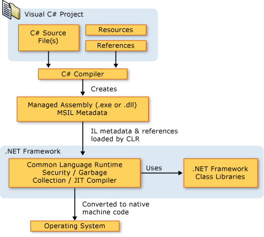

# C# 简介
C#是微软公司发布的一种由C和C++衍生出来的面向对象的编程语言、运行于.NET Framework和.NET Core(完全开源，跨平台)之上的高级程序设计语言。它在继承C和C++强大功能的同时去掉了一些它们的复杂特性（例如没有宏以及不允许多重继承）。C#综合了VB简单的可视化操作和C++的高运行效率，以其强大的操作能力、优雅的语法风格、创新的语言特性和便捷的面向组件编程的支持成为.NET开发的首选语言。

C# 使得C++程序员可以高效的开发程序，且因可调用由 C/C++ 编写的本机原生函数，而绝不损失C/C++原有的强大的功能。因为这种继承关系，C#与C/C++具有极大的相似性，熟悉类似语言的开发者可以很快的转向C#。

C# 可用于创建 Windows 客户端应用程序、XML Web service、分布式组件、客户端服务器应用程序、数据库应用程序等。

C# 语法简化了 C++ 的许多复杂操作，并提供强大功能，如可以为 null 的类型、枚举、委托、lambda 表达式和直接内存访问。 C# 不仅支持泛型方法和类型，提升了类型安全性和性能，还支持迭代器，以便集合类的实现者可以定义方便客户端代码使用的自定义迭代行为。 语言集成查询 (LINQ) 表达式让强类型查询成为最高级的语言构造。

作为面向对象的语言，C# 支持封装、继承和多态性这些概念。 所有变量和方法（包括作为应用程序入口点的 Main 方法）都封装在类定义中。 虽然类可能会直接继承一个父类，但可以实现任意数量的接口。 若要用方法重写父类中的虚方法，必须使用 override 关键字，以免发生意外重定义。 在 C# 中，结构就像是轻量级类，是可以实现接口但不支持继承的堆栈分配类型。

除了这些面向对象的基本原则，使用 C# 还可以通过以下多个创新语言构造更加轻松地开发软件组件：
- 封装的方法签名（名为“委托”），可实现类型安全事件通知。
- 用作私有成员变量的访问器的属性。
- 在运行时提供有关类型的声明性元数据的特性。
- 内联的 XML 文档注释。
- 语言集成查询 (LINQ)，提供跨各种数据源的内置查询功能。

如果需要与其他 Windows 软件（如 COM 对象或本机 Win32 DLL）进行交互，可以在 C# 中通过名为“互操作”的过程来实现。 借助互操作，C# 程序可以执行本机 C++ 应用程序可以执行的几乎任何操作。 在直接内存访问关键的情况下，C# 甚至支持指针和“不安全”代码的概念。

C# 生成过程比 C 和 C++ 更简单，比 Java 更灵活。 没有单独的头文件，也不要求按特定顺序声明方法和类型。 C# 源文件可以定义任意数量的类、结构、接口和事件。

# .NET Framework 平台体系结构
C# 程序在 .NET Framework 上运行，这是 Windows 不可或缺的一部分，包括名为“公共语言运行时 (CLR)”的虚执行系统和一组统一的类库。 CLR 是由 Microsoft 执行的公共语言基础结构 (CLI) 的商业实现，CLI 是作为执行和开发环境（语言和库在其中无缝协作）创建依据的国际标准。

用 C# 编写的源代码被编译成符合 CLI 规范的中间语言 (IL)。 IL 代码和资源（如位图和字符串）存储在磁盘上名为“程序集”的可执行文件（扩展名通常为 .exe 或 .dll）中。 程序集包含一个介绍程序集的类型、版本、区域性和安全要求的清单。

当 C# 程序执行时，程序集会加载到 CLR 中，可能根据清单中的信息执行各种操作。 然后，如果满足安全要求，CLR 会直接执行实时 (JIT) 编译，将 IL 代码转换成本机指令。 CLR 还提供其他与自动垃圾回收、异常处理和资源管理相关的服务。 CLR 执行的代码有时称为“托管代码”（而不是“非托管代码”），被编译成面向特定系统的本机语言。 下图展示了 C# 源代码文件、.NET Framework 类库、程序集和 CLR 的编译时和运行时关系。

语言互操作性是 .NET Framework 的一项重要功能。 由于 C# 编译器生成的 IL 代码符合公共类型规范 (CTS)，因此 C# 生成的 IL 代码可以与 .NET 版本 Visual Basic、Visual C++ 或其他任何符合 CTS 的超过 20 种语言生成的代码进行交互。 一个程序集可能包含多个用不同 .NET 语言编写的模块，且类型可以相互引用，就像是用同一种语言编写的一样。

除了运行时服务之外，.NET Framework 还包括一个由 4000 多个已整理到命名空间中的类构成的扩展库，这些类提供各种实用功能，包括文件输入输出、字符串控制、XML 分析和 Windows 窗体控件。 典型的 C# 应用程序广泛使用 .NET Framework 类库来处理常见的“管道”零碎工作。