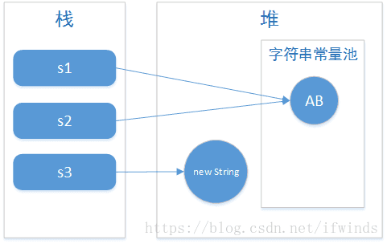

在Java语言中，所有类似“ABC”的字面值，都是String类的实例；String类位于java.lang包下，是Java语言的核心类，提供了字符串的比较、查找、截取、大小写转换等操作；Java语言为“+”连接符（字符串连接符）以及对象转换为字符串提供了特殊的支持，字符串对象可以使用“+”连接其他对象。String类的部分源码如下:
```java
public final class String
    implements java.io.Serializable, Comparable<String>, CharSequence {
    /** The value is used for character storage. */
    private final char value[];
    /** Cache the hash code for the string */
    private int hash; // Default to 0
    ...
}
```

从上面可以看出:
- String类被final关键字修饰，意味着String类不能被继承，并且它的成员方法都默认为final方法；字符串一旦创建就不能再修改。
- String类实现了Serializable、CharSequence、 Comparable接口。
- String实例的值是通过字符数组实现字符串存储的。


# 一、“+”连接符
## 1. “+”连接符的实现原理
Java语言为“+”连接符以及对象转换为字符串提供了特殊的支持，字符串对象可以使用“+”连接其他对象。其中字符串连接是通过 StringBuilder（或 StringBuffer）类及其append 方法实现的，对象转换为字符串是通过 toString 方法实现的，该方法由 Object 类定义，并可被 Java 中的所有类继承。有关字符连接和转换的更多信息，可以参阅 Gosling、Joy 和 Steele 合著的 《The Java Language Specification》
```java
/**
 * 测试代码
 */
public class Test {
    public static void main(String[] args) {
        int i = 10;
        String s = "abc";
        System.out.println(s + i);
    }
}
/**
 * 反编译后
 */
public class Test {
    public static void main(String args[]) {    //删除了默认构造函数和字节码
        byte byte0 = 10;      
        String s = "abc";      
        System.out.println((new StringBuilder()).append(s).append(byte0).toString());
    }
}
```
由上可以看出，Java中使用"+"连接字符串对象时，会创建一个StringBuilder()对象，并调用append()方法将数据拼接，最后调用toString()方法返回拼接好的字符串。由于append()方法的各种重载形式会调用String.valueOf方法，所以我们可以认为:
```java
//以下两者是等价的
s = i + ""
s = String.valueOf(i);
 
//以下两者也是等价的
s = "abc" + i;
s = new StringBuilder("abc").append(i).toString();
```

## 2. “+”连接符的效率
使用“+”连接符时，JVM会隐式创建StringBuilder对象，这种方式在大部分情况下并不会造成效率的损失，不过在进行大量循环拼接字符串时则需要注意。
```java
String s = "abc";
for (int i=0; i<10000; i++) {
    s += "abc";
}
/**
 * 反编译后
 */
String s = "abc";
for(int i = 0; i < 1000; i++) {
     s = (new StringBuilder()).append(s).append("abc").toString();    
}
```
这样由于大量StringBuilder创建在堆内存中，肯定会造成效率的损失，所以在这种情况下建议在循环体外创建一个StringBuilder对象调用append()方法手动拼接（如上面例子如果使用手动拼接运行时间将缩小到1/200左右）。
```java
/**
 * 循环中使用StringBuilder代替“+”连接符
 */
StringBuilder sb = new StringBuilder("abc");
for (int i = 0; i < 1000; i++) {
    sb.append("abc");
}
sb.toString();
```
与此之外还有一种特殊情况，也就是当"+"两端均为编译期确定的字符串常量时，编译器会进行相应的优化，直接将两个字符串常量拼接好，例如：
```java
System.out.println("Hello" + "World");
/**
 * 反编译后
 */
System.out.println("HelloWorld");
```
```java
/**
 * 编译期确定
 * 对于final修饰的变量，它在编译时被解析为常量值的一个本地拷贝存储到自己的常量池中或嵌入到它的字节码流中。
 * 所以此时的"a" + s1和"a" + "b"效果是一样的。故结果为true。
 */
String s0 = "ab"; 
final String s1 = "b"; 
String s2 = "a" + s1;  
System.out.println((s0 == s2)); //result = true
```
```java
/**
 * 编译期无法确定
 * 这里面虽然将s1用final修饰了，但是由于其赋值是通过方法调用返回的，那么它的值只能在运行期间确定
 * 因此s0和s2指向的不是同一个对象，故上面程序的结果为false。
 */
String s0 = "ab"; 
final String s1 = getS1(); 
String s2 = "a" + s1; 
System.out.println((s0 == s2)); //result = false 
 
public String getS1() {  
    return "b";   
}
```
综上，“+”连接符对于直接相加的字符串常量效率很高，因为在编译期间便确定了它的值，也就是说形如"I"+“love”+“java”; 的字符串相加，在编译期间便被优化成了"Ilovejava"。对于间接相加（即包含字符串引用，且编译期无法确定值的），形如s1+s2+s3; 效率要比直接相加低，因为在编译器不会对引用变量进行优化。

# 二、字符串常量池
在Java的内存分配中，总共3种常量池，分别是Class常量池、运行时常量池、字符串常量池。

字符串的分配和其他对象分配一样，是需要消耗高昂的时间和空间的，而且字符串使用的非常多。JVM为了提高性能和减少内存的开销，在实例化字符串的时候进行了一些优化：使用字符串常量池。每当创建字符串常量时，JVM会首先检查字符串常量池，如果该字符串已经存在常量池中，那么就直接返回常量池中的实例引用。如果字符串不存在常量池中，就会实例化该字符串并且将其放到常量池中。由于String字符串的不可变性，常量池中一定不存在两个相同的字符串。
```java
/**
 * 字符串常量池中的字符串只存在一份！
 * 运行结果为true
 */
String s1 = "hello world!";
String s2 = "hello world!";
System.out.println(s1 == s2);
```

## 1. 内存区域

在HotSpot VM中字符串常量池是通过一个StringTable类实现的，它是一个Hash表，默认值大小长度是1009；这个StringTable在每个HotSpot VM的实例中只有一份，被所有的类共享；字符串常量由一个一个字符组成，放在了StringTable上。要注意的是，如果放进String Pool的String非常多，就会造成Hash冲突严重，从而导致链表会很长，而链表长了后直接会造成的影响就是当调用String.intern时性能会大幅下降（因为要一个一个找）。

在JDK6及之前版本，字符串常量池是放在Perm Gen区(也就是方法区)中的，StringTable的长度是固定的1009；在JDK7版本中，字符串常量池被移到了堆中，StringTable的长度可以通过**-XX:StringTableSize=66666**参数指定。至于JDK7为什么把常量池移动到堆上实现，原因可能是由于方法区的内存空间太小且不方便扩展，而堆的内存空间比较大且扩展方便。

## 2. 存放的内容

在JDK6及之前版本中，String Pool里放的都是字符串常量；在JDK7.0中，由于String.intern()发生了改变，因此String Pool中也可以存放放于堆内的字符串对象的引用。
```java
/**
 * 运行结果为true false
 */
String s1 = "AB";
String s2 = "AB";
String s3 = new String("AB");
System.out.println(s1 == s2);
System.out.println(s1 == s3);
```
由于常量池中不存在两个相同的对象，所以s1和s2都是指向JVM字符串常量池中的"AB"对象。new关键字一定会产生一个对象，并且这个对象存储在堆中。所以String s3 = new String(“AB”);产生了两个对象：保存在栈中的s3和保存堆中的String对象。



当执行String s1 = "AB"时，JVM首先会去字符串常量池中检查是否存在"AB"对象，如果不存在，则在字符串常量池中创建"AB"对象，并将"AB"对象的地址返回给s1；如果存在，则不创建任何对象，直接将字符串常量池中"AB"对象的地址返回给s1。

## 3. intern方法
直接使用双引号声明出来的String对象会直接存储在字符串常量池中，如果不是用双引号声明的String对象，可以使用String提供的intern方法。intern 方法是一个native方法，intern方法会从字符串常量池中查询当前字符串是否存在，如果存在，就直接返回当前字符串；如果不存在就会将当前字符串放入常量池中，之后再返回。

JDK1.7的改动：
- 将String常量池 从 Perm 区移动到了 Java Heap区
- String.intern() 方法时，如果存在堆中的对象，会直接保存对象的引用，而不会重新创建对象。
