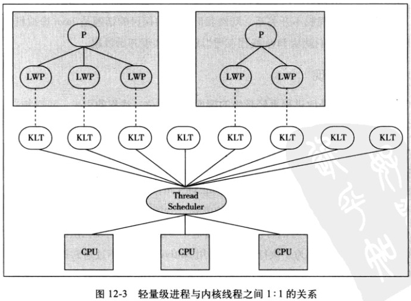
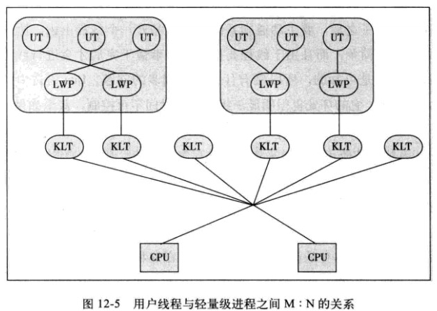

线程(Thread）是操作系统能够进行运算调度的最小单位。它被包含在进程之中，是进程中的实际运作单位。一条线程指的是进程中一个单一顺序的控制流，一个进程中可以并发多个线程，每条线程并行执行不同的任务。在Unix System V及SunOS中也被称为轻量进程（lightweight processes），但轻量进程更多指内核线程（kernel thread），而把用户线程（user thread）称为线程。

线程是独立调度和分派的基本单位。线程可以操作系统内核调度的内核线程，如Win32线程；由用户进程自行调度的用户线程，如Linux平台的POSIX Thread；或者由内核与用户进程，如Windows 7的线程，进行混合调度。

同一进程中的多条线程将共享该进程中的全部系统资源，如虚拟地址空间，文件描述符和信号处理等等。但同一进程中的多个线程有各自的调用栈（call stack），自己的寄存器环境（register context），自己的线程本地存储（thread-local storage）。

---

## 线程实现
Java中的线程都是调用的原生系统的本地函数，Java线程模型是基于操作系统原生线程模型实现的，实现线程有三种方式：内核线程实现、用户线程实现、混合线程实现。

### 内核线程实现
直接由操作系统内核支持的线程，通过内核来完成进程切换。每个内核线程就是一个内核的分身，这样操作系统就可以同时处理多件事情，支持多线程的内核被称为多线程内核。

程序一般不直接使用内核线程，而是使用一种高级接口——轻量级进程，轻量级进程就是我们通常意义上的线程，可以获得内核线程的支持，与内核线程构成1:1的线程模型。

由于得到内核线程的支持，每个轻量级进程都成为一个独立的调度单元，即时有一个轻量级进程在系统调用中阻塞，也不会影响整个进程，但也有其局限性：由于是基于内核线程实现的，各种操作，如创建、销毁及同步，都需要进行系统调用。而系统调用代价较高，需要在内核态和用户态来回切换。

### 用户线程实现

从广义上说，一个线程不是内核线程，就是用户线程，所以轻量级进程也属于用户线程。狭义的用户线程是指完全建立在用户空间上的，系统内核不能感知到其存在。

用户线程的创建、同步、销毁和调度都是在用户空间实现的，因此相对较快，代价相对较低。这种用户线程和进程是N:1的线程模型。

由于用户线程没有内核的支持，线程的创建、切换和调度是需要自己实现的，而且由于操作系统只把CPU资源分配到进程，那诸如“阻塞如何处理”、“多处理器系统中如何将线程映射到其他处理器”这类问题解决起来异常复杂。

### 混合实现

这种实现模式将内核线程与用户线程一起使用，在这种方式下既存在用户线程，也存在轻量级进程。用户线程还是完全建立在用户空间，因此用户线程的创建、切换等操作依旧低廉。而操作系统提供的轻量级进程则作为用户线程和内核线程的桥梁，这样就可以使用内核提供的线程调度及处理器映射。这种实现下，用户线程和轻量级进程是M:N的模式。

---

## Java线程调度
线程调度分为协同式和抢占式。
- 协同式调度：线程的执行时间由线程自己控制，这种的实现很简单，但是很可能造成很严重的后果。
- 抢占式调度：由操作系统分配线程执行的时间，线程切换的决定权在操作系统。
  
有时候我们需要为某些线程多分配时间，这时我们就需要用到线程优先级的方法，Java提供了10种优先级。Java优先级是在操作系统的原生线程优先级上实现的，所以对于同一个优先级，不同的操作系统可能有不同的表现，也就是说 Java线程优先级不是可靠的。

---

## Java线程状态切换
Java线程模型定义了 6 种状态，在任意一个时间点，一个线程有且只有其中一个状态：

- 新建（New）：新建的Thread，尚未开始。
- 运行（Runable）：包含操作系统线程状态中的Running、Ready，也就是处于正在执行或正在等待CPU分配时间的状态。
- 无限期等待（Waiting）：处于这种状态的线程不会被分配CPU时间，等待其他线程唤醒。
- 限期等待（Timed Waiting）：处于这种状态的线程不会被分配CPU时间，在一定时间后会由系统自动唤醒。
- 阻塞（Blocked）：在等待获得排他锁。
- 结束（Terminated）：已终止的线程。

