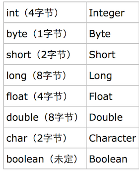

- Java中的数据类型分两大类分别是基本数据类型和引用数据类型。
- 基本数据类型分别是byte, short, int, long, char, float, double, boolean。 
- 在Java中，除了基本数据类型以外，其余的全都属于引用数据类型。

### 其中：
- 整型：byte, short, int, long
- 字符型：char
- 浮点型：float, double
- 布尔型：boolean

> Java中最小的计算单元为字节，1字节=8位（bit）。

### 一. 整型
&emsp;Java中整型数据属于有符号数，即第一个bit位为0表示正整数，第一个bit位为1表示负整数。

1. **byte**: byte属于Java中的整型，长度为1字节8bit，取值10000000（-128）到 01111111（127），变量初始化默认值为0，包装类Byte
2. **short**: short属于Java中的整型，长度为2字节16bit，取值10000000 00000000（-32768）到 01111111 11111111（32767），变量初始化默认值为0，包装类Short
3. **int**: int属于Java中的整型，长度为4字节32bit，取值-2^31 （-2,147,483,648）到 2^31-1（2,147,483,647），变量初始化默认值为0，包装类Integer
4. **long**: long属于Java中的整型，长度为8字节64bit，取值-2^63 （-9,223,372,036,854,775,808‬）到 2^63-1（9,223,372,036,854,775,8087），变量初始化默认值为0或0L，包装类Long

### 二. 浮点型
&emsp;Java中浮点型数据无法由二进制直接表示，而是一种对于实数的近似数据表示法，它遵循IEEE 754标准

1. **float**: float属于Java中的浮点型，也叫单精度浮点型，长度为4字节32bit，变量初始化默认值0.0f，包装类Float
2. **double**: double属于Java中的浮点型，也叫双精度浮点型，长度为8字节64bit，变量初始化默认值0.0d，包装类Double

### 三. 字符型
- **char**: char属于java中的字符型，占2字节16bit，可以赋值单字符以及整型数值, 变量初始化无默认值，包装类Character。

### 四. 布尔型
- **boolean**: 在JVM中并没有提供boolean专用的字节码指令，而boolean类型数据在经过编译后在JVM中会通过int类型来表示，此时boolean数据4字节32位，而boolean数组将会被编码成Java虚拟机的byte数组，此时每个boolean数据1字节占8bit.

>仅有两个值true, false，变量初始化默认值false

---

### 自动装箱与拆箱
- 装箱就是自动将基本数据类型转换为包装器类型；
- 拆箱就是自动将包装器类型转换为基本数据类型；
  
需要装箱拆箱的类型：

