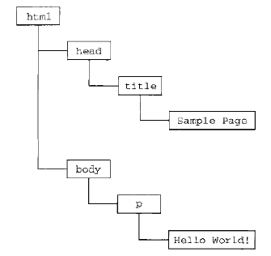

# Javascript

JavaScript（简称“JS”） 是一种具有函数优先的轻量级，解释型或即时编译型的编程语言。虽然它是作为开发Web页面的脚本语言而出名的，但是它也被用到了很多非浏览器环境中，JavaScript 基于原型编程、多范式的动态脚本语言，并且支持面向对象、命令式和声明式（如函数式编程）风格。

JavaScript在1995年由Netscape公司的Brendan Eich，在网景导航者浏览器上首次设计实现而成。因为Netscape与Sun合作，Netscape管理层希望它外观看起来像Java，因此取名为JavaScript。但实际上它的语法风格与Self及Scheme较为接近。

JavaScript的标准是ECMAScript 。截至 2012 年，所有浏览器都完整的支持ECMAScript 5.1，旧版本的浏览器至少支持ECMAScript 3 标准。2015年6月17日，ECMA国际组织发布了ECMAScript 的第六版，该版本正式名称为 ECMAScript 2015，但通常被称为ECMAScript 6 或者ES6。

## 基本特点
JavaScript是一种属于网络的脚本语言,已经被广泛用于Web应用开发,常用来为网页添加各式各样的动态功能,为用户提供更流畅美观的浏览效果。通常JavaScript脚本是通过嵌入在HTML中来实现自身的功能的。

- 是一种解释性脚本语言（代码不进行预编译）。 
- 主要用来向HTML（标准通用标记语言下的一个应用）页面添加交互行为。 
- 可以直接嵌入HTML页面，但写成单独的js文件有利于结构和行为的分离。 
- 跨平台特性，在绝大多数浏览器的支持下，可以在多种平台下运行（如Windows、Linux、Mac、Android、iOS等）。
- Javascript脚本语言同其他语言一样，有它自身的基本数据类型，表达式和算术运算符及程序的基本程序框架。Javascript提供了四种基本的数据类型和两种特殊数据类型用来处理数据和文字。而变量提供存放信息的地方，表达式则可以完成较复杂的信息处理。

## 历史
它最初由Netscape的Brendan Eich设计。JavaScript是甲骨文公司的注册商标。Ecma国际以JavaScript为基础制定了ECMAScript标准。JavaScript也可以用于其他场合，如服务器端编程。完整的JavaScript实现包含三个部分：ECMAScript，文档对象模型，浏览器对象模型。  

Netscape在最初将其脚本语言命名为LiveScript，后来Netscape在与Sun合作之后将其改名为JavaScript。JavaScript最初受Java启发而开始设计的，目的之一就是“看上去像Java”，因此语法上有类似之处，一些名称和命名规范也借自Java。但JavaScript的主要设计原则源自Self和Scheme。JavaScript与Java名称上的近似，是当时Netscape为了营销考虑与Sun微系统达成协议的结果。为了取得技术优势，微软推出了JScript来迎战JavaScript的脚本语言。为了互用性，Ecma国际（前身为欧洲计算机制造商协会）创建了ECMA-262标准（ECMAScript）。两者都属于ECMAScript的实现。尽管JavaScript作为给非程序人员的脚本语言，而非作为给程序人员的脚本语言来推广和宣传，但是JavaScript具有非常丰富的特性。 

发展初期，JavaScript的标准并未确定，同期有Netscape的JavaScript，微软的JScript和CEnvi的ScriptEase三足鼎立。1997年，在ECMA（欧洲计算机制造商协会）的协调下，由Netscape、Sun、微软、Borland组成的工作组确定统一标准：ECMA-262一种名为ECMAScript的新脚本语言的标准。

由ECMA-262定义的ECMAScript其实与Web浏览器没有依赖关系。Web浏览器只是ECMAScript实现可能的宿主环境之一。ECMA-262定义的只这门语言的基础，而在此基础上可能构建更完善的脚本语言。说回宿主，它不仅提供基本的JavaScript的实现，同时也会提供该语言的扩展，比如DOM。其他宿主环境还包括Node和Adobe Flash。

ECMA-262标准主要规定了这门语言的以下组成部分：

1.语法，2.类型，3.语句，4.关键字，5.保留字，6.操作符，7.对象。

## ECMAScript的版本

### ECMAScript 1 
1997年6月发布, 本质上与javascript 1.1 相同, 只不过只不过删除了所有针对浏览器的代码并作了一些较小的改动：ECMAScript要求支持Unicode标准，而且对象也变成了平台无关的。

### ECMAScript 2
1998年6月发布, 主要是编辑加工的结果。这一版的内容更新是为了与ISO/IEC-16262保持严格一致，没有作任何新增、修改或删节处理。因此，一般不使用第2版来衡量ECMAScript实现的兼容性。

### ECMAScript 3
1999年12月发布, 是对ECMAScript标准第一次真正的修改。新增了对正则表达式、新控制语句、try-catch异常处理的支持，修改了字符处理、错误定义和数值输出等内容。
从各方面综合来看，第3版标志着ECMAScript成为了一门真正的编程语言。也成为JavaScript的通行标准，得到了广泛支持。

### ECMAScript 4
2007年10月ECMAScript 4.0版草案发布。对3.0版做了大幅升级，预计次年8月发布正式版本。草案发布后，由于4.0版的目标过于激进，各方对于是否通过这个标准，发生了严重分歧。

以Yahoo、Microsoft、Google为首的大公司，反对JavaScript的大幅升级，主张小幅改动；以JavaScript创造者Brendan Eich为首的Mozilla公司，则坚持当前的草案。

#### 2008年7月ECMAScript 4.0发布前被废弃

由于对于下一个版本应该包括哪些功能，各方分歧太大，争论过于激进，ECMA开会决定，中止ECMAScript 4.0的开发（即废除了这个版本）。

将其中涉及现有功能改善的一小部分，发布为ECMAScript3.1，而将其他激进的设想扩大范围，放入以后的版本，由于会议的气氛，该版本的项目代号起名为Harmony（和谐）。

会后不久，ECMAScript 3.1就改名为ECMAScript 5。

### ECMAScript 5
2009年12月发布，Harmony项目则一分为二，一些较为可行的设想定名为JavaScript.next继续开发，后来演变成ECMAScript 6；
一些不是很成熟的设想，则被视为JavaScript.next.next，在更远的将来再考虑推出。

TC39的总体考虑是，ECMAScript5与ECMAScript3基本保持兼容，较大的语法修正和新功能加入，将由JavaScript.next完成。
(当时，JavaScript.next指的是ECMAScript 6。第六版发布以后，将指ECMAScript 7)
该版本力求澄清第3版中的歧义，并添加了新的功能。

新功能包括：原生JSON对象、继承的方法、高级属性的定义以及引入严格模式。

2011年6月发布，ECMAscript 5.1版发布。并且成为ISO国际标准（ISO/IEC16262:2011）。到了2012年底，所有主要浏览器都支持ECMAScript 5.1版的全部功能


### ECMAScript 6 (ES6)
2015年6月发布，ECMAScript 6正式发布，并且更名为“ECMAScript 2015”。这是因为TC39委员会计划，以后每年发布一个ECMAScirpt的版本，下一个版本在2016年发布，称为“ECMAScript 2016”。

从现在开始，新版本将按照ECMAScript+年份的形式发布。

S6是继S5之后的一次主要改进，语言规范由ES5.1时代的245页扩充至600页。尽管ES6做了大量的更新，但是它依旧完全向后兼容以前的版本。

ES6增添了许多必要的特性，新功能包括：模块和类以及一些实用特性，例如Maps、Sets、Promises、生成器（Generators）等。

### ECMAScript2016 (ES7)
2016 年 6 月：ECMAScript 的第 7 个版本。

### ECMAScript2017 (ES8)
2017 年 6 月：ECMAScript 的第 8 个版本。


## 文档对象模型（DOM）
文档对象模型是针对XML但经过扩展用于HTML的应用程序编程接口。DOM把整个页面映射为一个多层节点结构。HTML或XML页面中的每个组成部分都是某种类型的节点，这些节点又包含着不同类型的数据。

比如下面这个页面：
```xml
<html>
    <head>        
        <title>Sample Page</title>
    </head>
    <body>
        <p>Hello World!</p>   
    </body>          
</html>    
```

可以通过下面这个分层节点树表示：



通过DOM创建的这个表示文档的树形图（通常也被称作文档树），程序员可以通过DOM提供的API，轻松的对其中的任何节点进行删除、添加、修改等操作。

### DOM的级别：
DOM正式被统一规划源自微软与网景在开发DHTML(Dynamic HTML,动态HTML)上各持己见，DTHML的出现使得开发人员第一次无需重新加载网页就可以修改其内容。为了控制Netscape和微软在Web开发领域上两强割据，导致浏览器互不兼容的局面，负责制定Web通信标准的W3C（WorldWide Web Consortium,万维网联盟）开始着手规划DOM。

DOM 1级于1998年10月成为W3C的推荐标准。DOM 1级由两个部分组成：DOM核心（DOM Core）和DOM HTML。其中，DOM核心是规定如何映射基于XML的文档结构，以便对文档中的节点进行访问和操作。DOM HTML则在DOM的核心的基础上加以扩展，添加了针对HTML的对象和方法。这里需要注意的是，DOM并不是只针对JavaScript的，很多其他语言也都实现了DOM。只不在Web中，DOM已经成了JavaScript中重要的组成部分。

DOM 2级在原基础上扩展了鼠标和用户界面整件、范围、遍历等细分模块，而且通过对象接口增加了对CSS（Cascading Style Sheets，层叠样式表）的支持。

DOM 3级则进一步扩展了DOM，引入了加载和保存文档的方法。

## 浏览器对象模型（BOM）
开发人员可以使用BOM来控制浏览器显示页面以外的部分。而BOM真正与众不同或者说经常导致问题的地方在于它是JavaScript实现的一部分却不像DOM有着相关的标准。这个问题在HTML5中得到了解决，HTML5致力于把很多BOM功能写入规范。HTML5发布后，很多关于BOM的困惑也就消失了。从根本来讲，BOM只处理浏览器窗口和框架，但人们习惯上也把所有针对浏览器的JavaScript扩展算作BOM的一部分。下面就是一些这样的扩展:
- 弹出新浏览器窗口的功能；移动、缩放和关闭浏览器窗口的功能；
- 提供浏览器详细信息的navigator对象；
- 提供浏览器所加载页面的详细信息的location对象；
- 提供用户显示器分辨率详细信息的screen对象；
- 对cookies的支持；
- 像XMLHttpRequest和IE的ActiveXObject（AJAX的核心实现）这样的自定义对象。