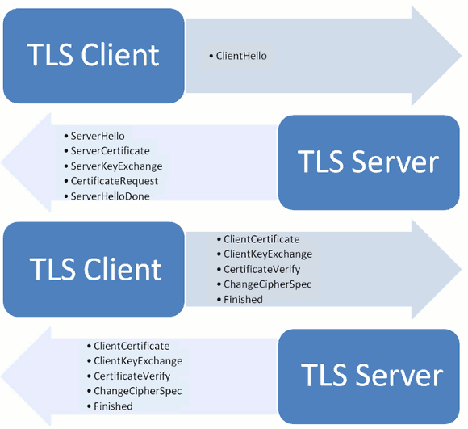

HTTPS 是一种通过计算机网络进行安全通信的传输协议。HTTPS经由HTTP进行通信，但利用 SSL/TLS 来加密数据包。 HTTPS 开发的主要目的，是提供对网站服务器的身份认证，保护交换数据的隐私与完整性。

HTTPS 的主要思想是在不安全的网络上创建一安全信道，并可在使用适当的加密包和服务器证书可被验证且可被信任时，对窃听和中间人攻击提供合理的防护。HTTPS的信任继承基于预先安装在浏览器中的证书颁发机构（如Symantec、Comodo、GoDaddy和GlobalSign等）（意即“我信任证书颁发机构告诉我应该信任的”）

---

## HTTP 为什么不安全
HTTP 协议属于 明文传输协议 ，交互过程以及数据传输都没有进行加密，通信双方也没有进行任何认证，通信过程非常容易遭遇劫持、监听、篡改，严重情况下，会造成恶意的流量劫持等问题，甚至造成个人隐私泄露（比如银行卡卡号和密码泄露）等严重的安全问题。

比如常见的，在 HTTP 通信过程中，“中间人”将广告链接嵌入到服务器发给用户的 HTTP 报文里，导致用户界面出现很多不良链接； 或者是修改用户的请求头 URL ，导致用户的请求被劫持到另外一个网站，用户的请求永远到不了真正的服务器。这些都会导致用户得不到正确的服务，甚至是损失惨重。

---

## HTTPS 如何保证安全
### 数字证书
TLS 握手的作用之一是 身份认证（authentication） ，被验证的一方需要提供一个身份证明，在 HTTPS 的世界里，这个身份证明就是 TLS 证书 ，或者称为 HTTPS 证书。

世界上的 CA 机构会遵守 X.509 规范来签发公钥证书（Public Key Certificate），证书内容的语法格式遵守 ASN.1，证书大致包含如下内容：
```txt
Certificate:
    Data:
        Version: 3 (0x2)                                                              //版本号
        Serial Number:                                                                //证书序列号
            0e:3c:c1:49:94:b3:e1:74:a6:34:54:d9:90:64:66:d7
    Signature Algorithm: sha256WithRSAEncryption                                      //签名算法
        Issuer: C=US, O=DigiCert Inc, OU=www.digicert.com, CN=GeoTrust RSA CA 2018    //签发机构
        Validity                                                                      //有效期
            Not Before: Dec 25 00:00:00 2017 GMT
            Not After : Dec 24 12:00:00 2020 GMT
        Subject: C=CN, L=北京市, O=智者四海（北京）技术有限公司, OU=IT, CN=*.zhihu.com      //证书主体
        Subject Public Key Info:
            Public Key Algorithm: rsaEncryption                                       //公钥算法
                Public-Key: (2048 bit)
                Modulus:
                    00:a0:a8:71:...                                                   //公钥
                Exponent: 65537 (0x10001)
        X509v3 extensions:                                                            //扩展信息
            X509v3 Authority Key Identifier: 
                keyid:90:58:FF:B0:9C:75:A8:51:54:77:B1:ED:F2:A3:43:16:38:9E:6C:C5     //授权密钥标识
            X509v3 Subject Key Identifier: 
                31:63:1F:A1:0B:43:D7:A5:8C:3D:F6:2E:85:69:D4:E1:E3:56:91:46           //主体密钥标识
            X509v3 Subject Alternative Name: 
                DNS:*.zhihu.com, DNS:zhihu.com
            X509v3 Key Usage: critical
                Digital Signature, Key Encipherment
            X509v3 Extended Key Usage: 
                TLS Web Server Authentication, TLS Web Client Authentication
            X509v3 CRL Distribution Points: 
                Full Name:
                  URI:http://cdp.geotrust.com/GeoTrustRSACA2018.crl

            X509v3 Certificate Policies: 
                Policy: 2.16.840.1.114412.1.1
                  CPS: https://www.digicert.com/CPS
                Policy: 2.23.140.1.2.2

            Authority Information Access: 
                OCSP - URI:http://status.geotrust.com
                CA Issuers - URI:http://cacerts.geotrust.com/GeoTrustRSACA2018.crt

            X509v3 Basic Constraints: 
                CA:FALSE
    Signature Algorithm: sha256WithRSAEncryption                                      //签名算法
         54:73:e6:02:...                                                              //数字签名
```
同一个CA颁发的证书序列号都必须是唯一的。

### 证书链
证书链是从终端用户证书后跟着一系列的 CA 证书，例如：CA_ZHIHU -> CA_GEO -> CA_ROOT，而通常 最后一个是自签名证书（根证书），并且有如下关系：
> A -> B 表示 “A是由B签发的” （更确切地说，A是由B中所载公钥对应的私钥签署的）

- 在证书链上除根证书外，证书颁发者等于其后一个证书的主题。即：CA_ZHIHU.Authority Key Identifier=CA_GEO.Subject Key Identifier
- 除了最后一个证书，每个证书都是由其后的一个证书签名的。即：CA_ZHIHU 由 CA_GEO 签名，CA_GEO 由 CA_ROOT 签名
- 最后的证书是信任主题，由于是通过可信过程得到的，你可以信任它，一般为系统内置。

证书链用于检查目标证书（证书链里的第一个证书）里的公钥及其它数据是否属于其主题。检查是这么做的，用证书链中的下一个证书的公钥来验证它的签名，一直检查到证书链的尾端，如果所有验证都成功通过，那个这个证书就是可信的。

### 证书认证
数字签名其实就是把 散列值 经过非对称加密算法加密得到的一个 加密的散列值 。数字签名一般用于身份认证和防止抵赖。

#### 根认证机构的构建
1. 根认证机构 CA 生成公钥 ca_KeyPub 和私钥 ca_KeyPri ，以及基本信息表 ca_Info （CSR）。ca_Info 中一般包含了 CA 的名称、证书的有效期等信息。
2. 根认证机构 CA 对 ca_KeyPub + ca_Info 进行散列运算，得到散列值 ca_Hash 。
3. 根认证机构 CA 使用其私钥 ca_KeyPri 对 ca_Hash 进行非对称加密，得到加密的散列值 enc_ca_Hash 。
4. 根认证机构 CA 将 ca_KeyPub + ca_Info + enc_ca_Hash 组合生成自签名的数字证书 ca_Cert 。这张证书称之为根证书。
5. ca_Cert 可用于签署下一级的证书。

#### 二级（或以上）认证机构的构建
1. 二级认证机构 CA2 生成公钥 ca2_KeyPub 和私钥 ca2_KeyPri ，以及基本信息表 ca2_Info 。 ca2_Info 中一般包含了 CA2 的名称、证书要求的有效期等信息。
2. 二级认证机构 CA2 将 ca2_KeyPub 、ca2_Info 送给根认证机构 CA 。
3. 根认证机构 CA 通过某种方式验证 CA2 的身份之后，再加上根认证机构自己的一些信息 ca_Info ，然后对它们 ca2_KeyPub + ca2_Info + ca_Info 进行散列运算，得到散列值 ca2_Hash 。
4. 根认证机构 CA 使用其私钥 ca_KeyPri 对 ca2_Hash 进行非对称加密，得到加密的散列值 enc_ca2_Hash 。
5. 根认证机构 CA 将 ca2_KeyPub + ca2_Info + ca_Info + enc_ca2_Hash 组合签署成数字证书 ca2_Cert 并回送给 CA2 。

#### 二级（或以上）认证机构的证书签署
1. 服务器 S2 下发证书 s2_Cert 、 ca2_Cert （证书链）给客户端 C 。
2. 客户端 C 检查到 s2_Cert 中的 ca2_Info ，发现它是由 CA2 签署的。
3. 客户端 C 取出 ca2_Cert 中的 ca2_KeyPub ，对 s2_Cert 中的 enc_s2_Hash 进行解密得到 s2_Hash 。
4. 客户端 C 对 s2_Cert 中的 s2_KeyPub + s2_Info + ca2_Info 进行散列运算，得到散列值 s2_Hash_tmp。
5. 客户端 C 判断 s2_Hash 和 s2_Hash_tmp 是否相等。如果两者相等，则证明 s2_Cert 是由 ca2_Cert 签署的。
6. 客户端 C 检查到 ca2_Cert 中的 ca_Info ，发现它是由 CA 签署的。
7. 客户端 C 取出 ca_Cert 中的 ca_KeyPub ，对 ca2_Cert 中的 enc_ca2_Hash 进行解密得到 ca2_Hash 。
8. 客户端 C 对 ca2_Cert 中的 ca2_KeyPub + ca2_Info + ca_Info 进行散列运算，得到散列值 ca2_Hash_tmp 。
9. 客户端 C 判断 ca2_Hash 和 ca2_Hash_tmp 是否相等。如果两者相等，证明 ca2_Cert 是由 ca_Cert 签署的。
10. 客户端 C 检查 ca_Cert ，发现该证书是根证书，且已经被系统信任，身份验证通过。

### 无 SNI 支持问题
很多公司由于业务众多，域名也是相当多的，为了方便运维，会让很多域名指向同样的 ip，然后统一将流量/请求分发到后端，此时就会面临一个问题：由于 TLS/SSL 在 HTTP 层之下，客户端和服务器握手的时候还拿不到 origin 字段，所以服务器不知道这个请求是从哪个域名过来的，而服务器这边每个域名都对应着一个证书，服务器就不知道该返回哪个证书啦。这个问题有两个通用解决方案：
- 使用 VIP 服务器，每个域名对应一个 VIP，然后 VIP 与统一接入服务对接，通过 ip 来分发证书，不过运维成本很高，可能也需要大量的 VIP 服务器
- 采用 多泛域名，将多个泛域名证书打包进一个证书。它的缺点是每次添加域名都需要更新证书。

### 证书选择
证书有多张加密方式，不同的加密方式对 CPU 计算的损耗不同，安全级别也不同。TLS 在进行第一次握手的时候，客户端会向服务器端 say hello，这个时候会告诉服务器，它支持哪些算法，此时 服务器可以将最适合的证书发给客户端。

### 证书的吊销
CA 证书的吊销存在两种机制，一种是 在线检查（OCSP），客户端向 CA 机构发送请求检查公钥的靠谱性；第二种是客户端储存一份 CA 提供的 证书吊销列表（CRL），定期更新。前者要求查询服务器具备良好性能，后者要求每次更新提供下次更新的时间，一般时差在几天。安全性要求高的网站建议采用第一种方案。

大部分 CA 并不会提供吊销机制（CRL/OCSP），靠谱的方案是 为根证书提供中间证书，一旦中间证书的私钥泄漏或者证书过期，可以直接吊销中间证书并给用户颁发新的证书。中间证书还可以产生下一级中间证书，多级证书可以减少根证书的管理负担。

---

## SSL/TLS协议
不使用SSL/TLS的HTTP通信，就是不加密的通信。所有信息明文传播，带来了三大风险。

- 窃听风险（eavesdropping）：第三方可以获知通信内容。
- 篡改风险（tampering）：第三方可以修改通信内容。
- 冒充风险（pretending）：第三方可以冒充他人身份参与通信。

SSL/TLS协议是为了解决这三大风险而设计的，希望达到：
- 所有信息都是加密传播，第三方无法窃听。
- 具有校验机制，一旦被篡改，通信双方会立刻发现。
- 配备身份证书，防止身份被冒充。

目前，应用最广泛的是 TLS 1.0，接下来是SSL 3.0。但是，主流浏览器都已经实现了 TLS 1.2 的支持。TLS 1.0通常被标示为SSL 3.1，TLS 1.1为SSL 3.2，TLS 1.2为SSL 3.3。

### TLS 运行过程
SSL/TLS协议的基本思路是采用 公钥加密法，也就是说，客户端先向服务器端索要公钥，然后用公钥加密信息，服务器收到密文后，用自己的私钥解密。因此，SSL/TLS协议的基本过程是这样的：
- 客户端向服务器端索要并验证公钥。
- 双方协商生成"对话密钥”。
- 双方采用"对话密钥"进行加密通信。



“握手阶段"涉及四次通信，我们一个个来看。需要注意的是，“握手阶段"的所有通信都是明文的。

#### 客户端发出请求（ClientHello）
首先，客户端（通常是浏览器）先向服务器发出加密通信的请求，这被叫做 ClientHello 请求。

在这一步，客户端主要向服务器提供以下信息。

1. 支持的协议版本，比如TLS 1.0版。
2. 一个客户端生成的随机数，稍后用于生成对话密钥。
3. 支持的加密方法，比如RSA公钥加密。
4. 支持的压缩方法。

这里需要注意的是，客户端发送的信息之中不包括服务器的域名。也就是说，理论上服务器只能包含一个网站，否则会分不清应该向客户端提供哪一个网站的数字证书。这就是为什么通常一台服务器只能有一张数字证书的原因。

对于虚拟主机的用户来说，这当然很不方便。2006年，TLS协议加入了一个 Server Name Indication 扩展，允许客户端向服务器提供它所请求的域名。

#### 服务器回应（SeverHello）
服务器收到客户端请求后，向客户端发出回应，这叫做 SeverHello 。服务器的回应包含以下内容。

1. 确认使用的加密通信协议版本，比如TLS 1.0版本。如果浏览器与服务器支持的版本不一致，服务器关闭加密通信。
2. 一个服务器生成的随机数，稍后用于生成对话密钥。
3. 确认使用的加密方法，比如 RSA 公钥加密。
4. 服务器证书。
   
除了上面这些信息，如果服务器需要确认客户端的身份，就会再包含一项请求，要求客户端提供 “客户端证书”。比如，金融机构往往只允许认证客户连入自己的网络，就会向正式客户提供 USB 密钥，里面就包含了一张客户端证书。

#### 客户端回应
客户端收到服务器回应以后，首先验证服务器证书。如果证书不是可信机构颁布、或者证书中的域名与实际域名不一致、或者证书已经过期，就会向访问者显示一个警告，由其选择是否还要继续通信。

如果证书没有问题，客户端就会从证书中取出服务器的公钥。然后，向服务器发送加密信息，包含下面三项信息。
- 一个随机数。该随机数用服务器公钥加密，防止被窃听。
- 编码改变通知，表示随后的信息都将用双方商定的加密方法和密钥发送。
- 客户端握手结束通知，表示客户端的握手阶段已经结束。这一项同时也是前面发送的所有内容的hash值，用来供服务器校验。

上面第一项的随机数，是整个握手阶段出现的第三个随机数，又称 pre-master key 。有了它以后，客户端和服务器就同时有了三个随机数，接着双方就用事先商定的加密方法，各自生成本次会话所用的同一把"会话密钥”。

至于 为什么一定要用三个随机数，来生成"会话密钥”：
- 不管是客户端还是服务器，都需要随机数，这样生成的密钥才不会每次都一样。由于SSL协议中证书是静态的，因此十分有必要引入一种随机因素来保证协商出来的密钥的随机性。
- 对于 RSA 密钥交换算法来说，pre-master-key本身就是一个随机数，再加上 hello 消息中的随机，三个随机数通过一个密钥导出器最终导出一个对称密钥。
- pre master 的存在在于 SSL 协议不信任每个主机都能产生完全随机的随机数，如果随机数不随机，那么 pre master secret（对称密钥） 就有可能被猜出来，那么仅适用 pre master secret 作为密钥就不合适了，因此必须引入新的随机因素，那么客户端和服务器三个随机数一同生成的密钥就不容易被猜出了，一个伪随机可能完全不随机，可是是三个伪随机就十分接近随机了，每增加一个自由度，随机性增加的可不是一个量级。

此外，如果前一步，服务器要求客户端证书，客户端会在这一步发送证书及相关信息。

#### 服务器的最后回应
服务器收到客户端的第三个随机数 pre-master key 之后，计算生成本次会话所用的"会话密钥”。然后，向客户端最后发送下面信息。

- 编码改变通知，表示随后的信息都将用双方商定的加密方法和密钥发送。
- 服务器握手结束通知，表示服务器的握手阶段已经结束。这一项同时也是前面发送的所有内容的 hash 值，用来供客户端校验。
  
至此，整个握手阶段全部结束。接下来，客户端与服务器进入加密通信，就完全是使用普通的HTTP协议，只不过用"会话密钥"加密内容。

---

## HTTPS 的七个误解
- HTTPS无法缓存？：许多人以为，出于安全考虑，浏览器不会在本地保存HTTPS缓存。实际上，只要在HTTP头中使用特定命令，HTTPS是可以缓存的。
- SSL证书很贵？：如果你在网上搜一下，就会发现很多便宜的SSL证书，大概10美元一年，这和一个 .com 域名的年费差不多。而且事实上，还能找到免费的 SSL 证书。
- HTTPS站点必须有独享的IP地址？使用子域名通配符SSL证书（wildcard SSL certificate，价格大约是每年125美元），就能在一个IP地址上部署多个HTTPS子域名。
转移服务器时要购买新证书？
- HTTPS太慢？：使用HTTPS不会使你的网站变得更快（实际上有可能，请看下文），但是有一些技巧可以大大减少额外开销。
- 有了HTTPS，Cookie和查询字符串就安全了？：虽然无法直接从HTTPS数据中读取Cookie和查询字符串，但是你仍然需要使它们的值变得难以预测。
- 只有注册登录页，才需要HTTPS？：这种想法很普遍。人们觉得，HTTPS可以保护用户的密码，此外就不需要了。Firefox浏览器新插件Firesheep，证明了这种想法是错的。我们可以看到，在Twitter和Facebook上，劫持其他人的session是非常容易的。

---

## 中间人攻击（MITM）
### TLS对中间人攻击的抵御

当然正常情况下，我们的网络安全肯定不会这么脆弱。得利于TLS证书体系，虽然我们能发起中间人攻击，不过浏览器察觉到了证书的异常。这是因为我们冒充了目标网站，但是并没有目标网站的证书，这样浏览器在校验证书时很容易发现证书错误。

### 无法抵御中间人攻击的实例

部分开发者忽视证书校验，或对证书异常处理不当，导致本来十分有效LTS失去原本的防御能力。有许多APP存在类似的问题，包括个别金融类应用，还有部分APP部分模块的流量存在被劫持的风险。


