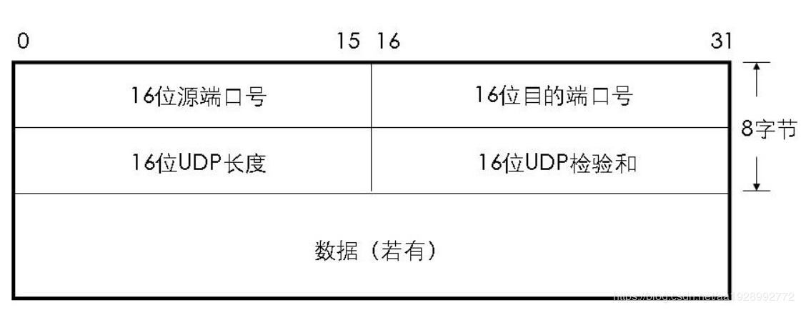
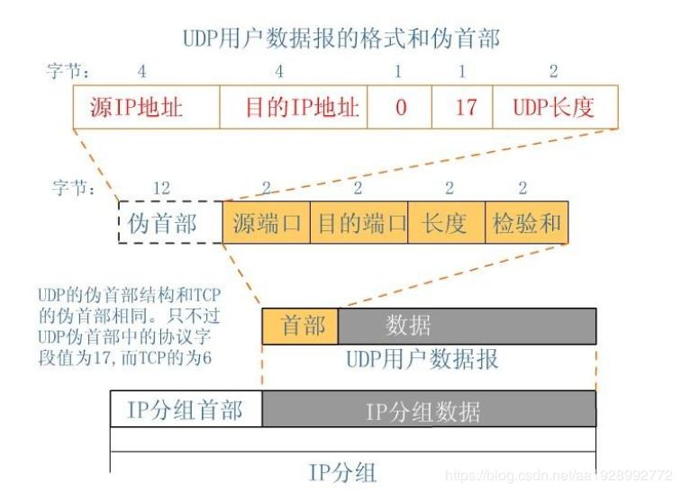
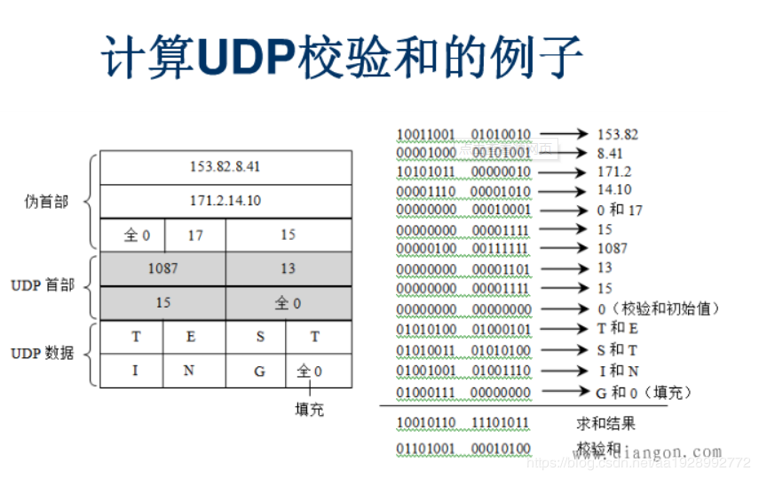

UDP(User Datagram Protocol)， 中文名是用户数据报协议，是OSI（Open System Interconnection，开放式系统互联） 参考模型中一种无连接的传输层协议，提供面向事务的简单不可靠信息传送服务，IETF RFC 768 是UDP的正式规范。UDP在IP报文的协议号是17。

UDP协议与TCP协议一样用于处理数据包，在OSI模型中，两者都位于传输层，处于IP协议的上一层。UDP有不提供数据包分组、组装和不能对数据包进行排序的缺点，也就是说，当报文发送之后，是无法得知其是否安全完整到达的。UDP用来支持那些需要在计算机之间传输数据的网络应用。包括网络视频会议系统在内的众多的客户/服务器模式的网络应用都需要使用UDP协议。UDP协议从问世至今已经被使用了很多年，虽然其最初的光彩已经被一些类似协议所掩盖，但即使在今天UDP仍然不失为一项非常实用和可行的网络传输层协议。

许多应用只支持UDP，如：多媒体数据流，不产生任何额外的数据，即使知道有破坏的包也不进行重发。当强调传输性能而不是传输的完整性时，如：音频和多媒体应用，UDP是最好的选择。在数据传输时间很短，以至于此前的连接过程成为整个流量主体的情况下，UDP也是一个好的选择。

#### UDP是传输层的协议，功能即为在IP的数据报服务之上增加了最基本的服务：复用和分用以及差错检测。

&nbsp;

## UDP 特点
- UDP无连接，时间上不存在建立连接需要的时延。空间上，TCP需要在端系统中维护连接状态，需要一定的开销。此连接装入包括接收和发送缓存，拥塞控制参数和序号与确认号的参数。UCP不维护连接状态，也不跟踪这些参数，开销小。空间和时间上都具有优势。
- 分组首部开销小，TCP首部20字节，UDP首部8字节。
- UDP没有拥塞控制，应用层能够更好的控制要发送的数据和发送时间，网络中的拥塞控制也不会影响主机的发送速率。某些实时应用要求以稳定的速度发送，能容 忍一些数据的丢失，但是不能允许有较大的时延（比如实时视频，直播等）
- UDP提供尽最大努力的交付，不保证可靠交付。所有维护传输可靠性的工作需要用户在应用层来完成。没有TCP的确认机制、重传机制。如果因为网络原因没有传送到对端，UDP也不会给应用层返回错误信息
- UDP是面向报文的，对应用层交下来的报文，添加首部后直接乡下交付为IP层，既不合并，也不拆分，保留这些报文的边界。对IP层交上来UDP用户数据报，在去除首部后就原封不动地交付给上层应用进程，报文不可分割，是UDP数据报处理的最小单位。
正是因为这样，UDP显得不够灵活，不能控制读写数据的次数和数量。比如我们要发送100个字节的报文，我们调用一次sendto函数就会发送100字节，对端也需要用recvfrom函数一次性接收100字节，不能使用循环每次获取10个字节，获取十次这样的做法。
- UDP常用一次性传输比较少量数据的网络应用，如DNS,SNMP等，因为对于这些应用，若是采用TCP，为连接的创建，维护和拆除带来不小的开销。UDP也常用于多媒体应用（如IP电话，实时视频会议，流媒体等）数据的可靠传输对他们而言并不重要，TCP的拥塞控制会使他们有较大的延迟，也是不可容忍的

&nbsp;

## UDP的首部格式
UDP数据报分为首部和用户数据部分，整个UDP数据报作为IP数据报的数据部分封装在IP数据报中，UDP数据报文结构如图所示：

UDP首部有8个字节，由4个字段构成，每个字段都是两个字节，
1. 源端口： 源端口号，需要对方回信时选用，不需要时全部置0.
2. 目的端口：目的端口号，在终点交付报文的时候需要用到。
3. 长度：UDP的数据报的长度（包括首部和数据）其最小值为8（只有首部）
4. 校验和：检测UDP数据报在传输中是否有错，有错则丢弃。
   - 该字段是可选的，当源主机不想计算校验和，则直接令该字段全为0.

当传输层从IP层收到UDP数据报时，就根据首部中的目的端口，把UDP数据报通过相应的端口，上交给应用进程。

如果接收方UDP发现收到的报文中的目的端口号不正确（不存在对应端口号的应用进程0,），就丢弃该报文，并由ICMP发送“端口不可达”差错报文给对方。

&nbsp;

## UDP校验
在计算校验和的时候，需要在UDP数据报之前增加12字节的伪首部，伪首部并不是UDP真正的首部。只是在计算校验和，临时添加在UDP数据报的前面，得到一个临时的UDP数据报。校验和就是按照这个临时的UDP数据报计算的。伪首部既不向下传送也不向上递交，而仅仅是为了计算校验和。这样的校验和，既检查了UDP数据报，又对IP数据报的源IP地址和目的IP地址进行了检验。

UDP校验和的计算方法和IP数据报首部校验和的计算方法相似，都使用二进制反码运算求和再取反，但不同的是：IP数据报的校验和之检验IP数据报和首部，但UDP的校验和是把首部和数据部分一起校验。

发送方，首先是把全零放入校验和字段并且添加伪首部，然后把UDP数据报看成是由许多16位的子串连接起来，若UDP数据报的数据部分不是偶数个字节，则要在数据部分末尾增加一个全零字节（此字节不发送），接下来就按照二进制反码计算出这些16位字的和。将此和的二进制反码写入校验和字段。在接收方，把收到得UDP数据报加上伪首部（如果不为偶数个字节，还需要补上全零字节）后，按二进制反码计算出这些16位字的和。当无差错时其结果全为1,。否则就表明有差错出现，接收方应该丢弃这个UDP数据报。

#### 注意：
1. 校验时，若UDP数据报部分的长度不是偶数个字节，则需要填入一个全0字节，但是次字节和伪首部一样，是不发送的。
2. 如果UDP校验和校验出UDP数据报是错误的，可以丢弃，也可以交付上层，但是要附上错误报告，告诉上层这是错误的数据报。
3. 通过伪首部，不仅可以检查源端口号，目的端口号和UDP用户数据报的数据部分，还可以检查IP数据报的源IP地址和目的地址。
这种差错检验的检错能力不强，但是简单，速度快
