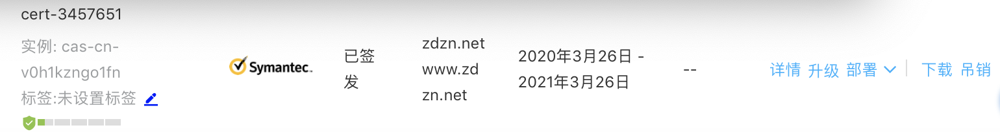

## Nginx配置SSL

申请个人免费的SSL证书,[申请地址](https://common-buy.aliyun.com/?spm=5176.7968328.1290860.18.326b1232fatkkb&commodityCode=cas&request=%7B%22cer_type%22:%22personal%22,%22domain_type%22:%22one%22,%22brand%22:%22twtrust%22,%22domain_num%22:%221%22,%22order_num%22:1,%22ord_time%22:%221:Year%22%7D)


列表中找到已签发的证书，下载：


点击下载,选择Nginx

下载的文件有两个：

- 3666251_zdzn.net.pem
- 3666251_zdzn.net.key

在Nginx安装目录/usr/local/nginx/conf/ 下新建文件夹cert.把刚刚下载的两个文件上传到cert/文件夹中。

nginx.conf中如下配置:
```txt
server {
    listen 443;
    server_name zdzn.net; // 你的域名
    ssl on;
    ssl_certificate  cert/3666251_zdzn.net.pem;// 改成你的证书的名字
    ssl_certificate_key cert/3666251_zdzn.net.key;// 你的证书的名字
    ssl_session_timeout 5m;
    ssl_ciphers
		ECDHE-RSA-AES128-GCM-SHA256:ECDHE:ECDH:AES:HIGH:!NULL:!aNULL:!MD5:!ADH:!RC4;
    ssl_protocols TLSv1 TLSv1.1 TLSv1.2;
    ssl_prefer_server_ciphers on;
    location / {
        index index.html index.htm;
    }
}
server {
    listen 80;
    server_name zdzn.net;// 你的域名
    rewrite ^(.*)$ https://$host$1 permanent;// 把http的域名请求转成https
}
```

配置完成后，检查一下nginx配置文件是否可用，有successful表示可用。
```txt
nginx -t // 检查nginx配置文件
```

配置正确后，重新加载配置文件使配置生效：
```txt
nginx -s reload // 使配置生效
```

至此，nginx的https访问就完成了，并且通过rewrite方式把所有http请求也转成了https请求，更加安全。

如需重启nginx，用以下命令：
```txt
$ service nginx stop // 停止
$ service nginx start // 启动
$ service nginx restart // 重启
```
