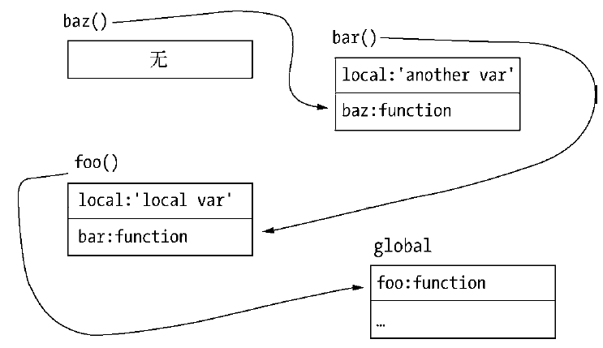
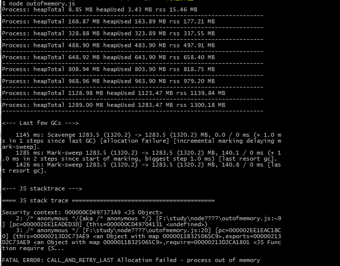

# 高效使用内存
提到如何触发垃圾回收，第一个要介绍的是作用域（scope）。在js中能形成作用域的有函数调用、with以及全局作用域。

```js
var foo = function() {
    var local = {};
};
```

foo()函数在每次被调用时会创建对应的作用域，函数执行结束后，该作用域将会销毁。同时作用域中声明的局部变量分配在该作用域上，随作用域的销毁而销毁。只被局部变量引用的对象存活周期较短。在这个示例中，由于对象非常小，将会分配在新生代中的From空间中。在作用域释放后，局部变量local失效，其引用的对象将会在下次垃圾回收时被释放。

### 以上是最基本的内存回收过程。

## 标识符查找
与作用域相关的即是标识符查找。所谓标识符，可以理解为变量名。在下面的代码中，执行bar()函数时，将会遇到local变量：
```js
var bar = function() {
  console.log(local);
};
```

js在执行时会去查找该变量定义在哪里。它最先查找的是当前作用域，如果在当前作用域中无法找到该变量的声明，将会向上级的作用域里查找，直到查到为止。

## 作用域链
```js
var foo = function() {
  var local = 'local var';
  var bar = function() {
    var local = 'another var';
    var baz = function() {
      console.log(local);
    };
    baz();
  };
  bar();
};
foo();
```
local变量在baz()函数形成的作用域里查找不到，继而将在bar()的作用域里寻找。如果去掉上述代码bar()中的local声明，将会继续向上查找，一直到全局作用域。这样的查找方式使得作用域像一个链条。由于标识符的查找方向是向上的，所以变量只能向外访问，而不能向内访问。如下图：



当我们在baz()函数中访问local变量时，由于作用域中的变量列表中没有local，所以会向上一个作用域中查找，接着会在bar()函数执行得到的变量列表中找到了一个local变量的定义，于是使用它。尽管在上一层的作用域中也存在local的定义，但是不会继续查找了。如果查找一个不存在的变量，将会一直沿着作用域链查找到全局作用域，最后抛出未定义错误。

## 变量的主动释放
如果变量是全局变量（不通过var声明或定义在global变量上），由于全局作用域需要直到进程退出才能释放，此时将导致引用的对象常驻内存（常驻在老生代中）。如果需要释放常驻内存的对象，可以通过delete操作来删除引用关系。或者将变量重新赋值，让旧的对象脱离引用关系。举个示例，老生代内存清除和整理的过程中，会被回收释放

```js
global.foo = "I am global object";
console.log(global.foo); // => "I am global object"
delete global.foo;
// 或者重新赋值
global.foo = undefined; // or null
console.log(global.foo); // => undefined
```

### 同样，如果在非全局作用域中，想主动释放变量引用的对象，也可以通过这样的方式。虽然delete操作和重新赋值具有相同的效果，但是在V8中通过delete删除对象的属性有可能干扰V8的优化，所以通过赋值方式解除引用更好。

## 闭包
下面代码，local会得到未定义的异常：

```js
var foo = function() {
  (function() {
    var local = "局部变量";
  }());
  console.log(local);
};
```

在js中，实现外部作用域访问内部作用域中变量的方法叫做闭包（closure）。这得益于高阶函数的特性：函数可以作为参数或者返回值。

```js
var foo = function() {
  var bar = function() {
    var local = "局部变量";
    return function() {
      return local;
    };
  };
  var baz = bar();
  console.log(baz());
};
```
### 在bar()函数执行完成后，局部变量local将会随着作用域的销毁而被回收。但是注意这里的特点在于返回值是一个匿名函数，且这个函数中具备了访问local的条件。虽然在后续的执行中，在外部作用域中还是无法直接访问local，但是若要访问它，可以通过中间函数来过渡。

### 闭包是js的高级特性，利用它可以产生很多巧妙的效果。它的问题在于，一旦有变量引用这个中间函数，这个中间函数将不会释放，同时也会使原始的作用域得不到释放，作用域中产生的内存占用也不会得到释放。除非不再有引用，才会逐步释放。

### 在正常js执行中，无法立即回收的内存有闭包和全局变量引用这两种情况。由于V8的内存限制，要十分小心此类变量是否无限制地增加，因为它会导致老生代中的对象增多。

---

# 内存指标
## 查看内存使用情况
前面用到的process.memoryUsage()可以查看内存使用情况。除此之外，os模块中totalmem()和freemem()方法也可以查看内存使用情况。

### 查看进程的内存占用
调用process.memoryUsage()可以看到Node进程的内存占用情况，示例代码如下：

```js
`$` node
`>` process.memoryUsage()
{
  rss: 18821120,
  heapTotal: 10295296,
  heapUsed: 5013664
}
```
### rss是resident set size的缩写，即进程的常驻内存部分。进程的内存总共有几部分，一部分是rss，其余部分在交换区（swap）或者文件系统（filesystem）中。

### 除了rss外，heapTotal和heapUsed对应的是V8的堆内存信息。heapTotal是堆中总共申请的内存量，heapUsed表示目前堆中使用中的内存量。这3个值的单位都是字节。为了更好地查看效果，我们格式化一下输出结果：

```js
var showMem = function() {
  var mem = process.memoryUsage();
  var format = function(bytes) {
    return (bytes / 1024 / 1024).toFixed(2) + ' MB';
  };
  console.log('Process: heapTotal ' + format(mem.heapTotal) + ' heapUsed ' + format(mem.heapUsed) + ' rss ' + format(mem.rss));
  console.log('---------------------------------------------------------------------------');
};
```

同时，写一个方法用于不停地分配内存但不释放内存，相关代码如下：
```js
var useMem = function() {
  var size = 20 * 1024 * 1024;
  var arr = new Array(size);
  for (var i = 0; i < size; i++) {
    arr[i] = 0;
  }
  return arr;
};
var total = [];
for (var j = 0; j < 15; j++) {
  showMem();
  total.push(useMem());
}
showMem();
```
将以上代码存为outofmemory.js并执行它，得到的输出结果如下：



可以看到，每次调用useMem都导致了3个值的增长。在接近1500MB的时候，无法继续分配内存，然后进程内存溢出了，连循环体都无法执行完成，仅执行了9次。

### 查看系统的内存占用
与process.memoryUsage()不同的是，os模块中的totalmem()和freemem()这两个方法用于查看操作系统的内存使用情况，它们分别返回系统的总内存和闲置内存，以字节为单位。示例代码如下：
```txt
`$` node
`>` os.totalmem()
`>` 12798062592
`>` os.freemem()
`>` 2753875968
```
### 从输出信息看，这台电脑总内存为8GB，当前闲置内存大致为4.2GB。

## 堆外内存
>通过process.memoryUsage()的结果可以看到，堆中的内存用量总是小于进程的常驻内存用量。这意味着Node中的内存使用并非都是通过V8进行分配的。我们将那些不是通过V8分配的内存称为堆外内存。

这里将前面的useMem()方法稍微改造一下，将Array变为Buffer，将size变大，每一次构造200MB的对象，相关代码如下：
```js
var useMem = function() {
  var size = 200 * 1024 * 1024;
  var buffer = new Buffer(size);
  for (var i = 0; i < size; i++) {
    buffer[i] = 0;
  }
  return buffer;
};
```

重新执行该代码，得到的输出结果如下所示：


### 15次循环都完整执行，并且三个内存占用值与前一个示例完全不同。在改造后的输出结果中，heapTotal和heapUsed的变化极小，唯一变化的是rss的值，并且该值已经远远超过V8的限制值。这其中的原因是Buffer对象不同于其他对象，它不经过V8的内存分配机制，所以也不会有堆内存的大小限制。

### 这意味着利用堆外内存可以突破内存限制的问题。

### 为何Buffer对象并非通过V8分配？这在于Node并不同于浏览器的应用场景。在浏览器中，js直接处理字符串即可满足绝大多数的业务需求，而Node则需要处理网络流和文件I/O流，操作字符串远远不能满足传输的性能需求。


### 从上面得知，Node内存构成主要由通过V8进行分配的部分和Node自行分配的部分。受V8的垃圾回收限制的主要是V8的堆内存。